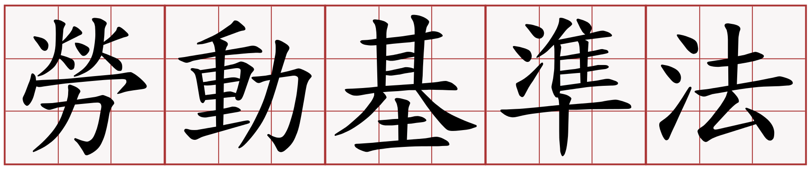

# 勞動基準法

為規定勞動條件最低標準，保障勞工權益，加強勞雇關係，促進社會與經濟發展，特制定本法；本法未規定者，適用其他法律之規定。

雇主與勞工所訂勞動條件，不得低於本法所定之最低標準。

## 公布與修正日期

公布日期：民國73年07月30日

修正日期：民國105年12月21日

## 生效狀況

本法規部分或全部條文尚未生效。

本法105.12.21修正之第34條第2項規定，施行日期由行政院定之。

## 修正沿革

1. 中華民國七十三年七月三十日總統（73）華總（一）義字第14069號令制定公布全文86條
2. 中華民國八十五年十二月二十七日總統（85）華總（一）義字第8500298370號令修正公布第3條條文；並增訂第30-1、84-1、84-2條條文
3. 中華民國八十七年五月十三日總統（87）華總（一）義字第8700098000號令修正公布第30-1條條文
4. 中華民國八十九年六月二十八日總統（89）華總一義字第8900158760號令修正公布第30條條文
5. 中華民國八十九年七月十九日總統（89）華總一義字第8900177630號令修正公布第4、72條條文
6. 中華民國九十一年六月十二日總統華總一義字第09100120620號令修正公布第3、21、30-1、56條條文
7. 中華民國九十一年十二月二十五日總統華總一義字第09100248770號令修正公布第30、30-1、32、49、77、79、86條條文；本法自公布日施行，但中華民國八十九年六月二十八日修正公布之第30條第1項及第2項規定自中華民國九十年一月一日施行
8. 中華民國九十七年五月十四日總統華總一義字第09700055071號令修正公布第54條條文
9. 中華民國九十八年四月二十二日總統華總一義字第09800094001號令修正公布第53條條文
10. 中華民國一百年六月二十九日總統華總一義字第10000136181號令修正公布第75～79、80條條文；增訂第79-1條條文
11. 中華民國一百零二年十二月十一日總統華總一義字第10200225221號令修正公布第45、47、77、79-1條條文中華民國一百零三年二月十四日行政院院臺規字第1030124618號公告第4條所列屬「行政院勞工委員會」之權責事項，自一百零三年二月十七日起改由「勞動部」管轄；第28條第5項所列屬「勞工保險局」之權責事項，自一百零三年二月十七日起，積欠工資墊償基金收繳、墊償業務，改由「勞動部勞工保險局」管轄；積欠工資墊償基金投資及運用業務，改由「勞動部勞動基金運用局」管轄；第56條第2項所列屬「勞工退休基金監理委員會」之權責事項，自一百零三年二月十七日起，監理業務改由「勞動部」管轄；勞工退休基金投資及運用業務，改由「勞動部勞動基金運用局」管轄
12. 中華民國一百零四年二月四日總統華總一義字第10400012401號令修正公布第17、28、55、56、78、79、86條條文；增訂第80-1條條文；除第28條第1項自公布後八個月施行外，自公布日施行
13. 中華民國一百零四年六月三日總統華總一義字第10400064421號令修正公布第4、30、79、86條條文；並自一百零五年一月一日施行
14. 中華民國一百零四年七月一日總統華總一義字第10400077211號令修正公布第58條條文
15. 中華民國一百零四年十二月十六日總統華總一義字第10400146731號令修正第44、46條條文；增訂第9-1、10-1、15-1條條文
16. 中華民國一百零五年十一月十六日總統華總一義字第10500140131號令修正公布第14條條文
17. 中華民國一百零五年十二月二十一日總統華總一義字第10500157731號令修正公布第23、24、30-1、34、36～39、74、79條條文；並自公布日施行；但第34條第2項規定，施行日期由行政院定之；第37條第1項規定及第38條條文，自一百零六年一月一日施行
